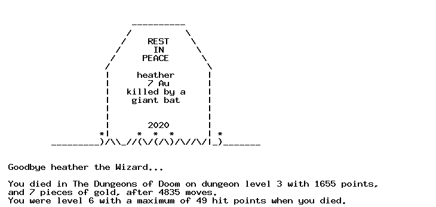

# Terminal
PHP parser for ttyrec-files.


> File in example/game.ttyrec from https://alt.org/nethack/
>
> Creative Commons Attribution 4.0 International License.


## Requirements
- PHP 7.4
- Load composer https://getcomposer.org/
- composer install
- php example/example.php

```
// this so that composer autoload is loaded
require __DIR__ . './vendor/autoload.php';

use Terminal\Terminal;
use Terminal\Interpret;
use Terminal\Screen;

$file = __DIR__."/game.ttyrec";
$terminal = new Terminal($file);

// how to play the ttyrec file

// with actual delay coded in ttyrec file
$terminal->printScreens(true);
// speedy gonzales with small delay
$terminal->printScreens(false, 1000);
// quarter of a second delay between frames
$terminal->printScreens();


// if you wish to write the screens into files
// prequisite mkdir temp
$terminal->loopScreens(true);

// or print the screens / commands in screens
$screens = $terminal->getScreens();
/** @var Screen $screen */
foreach ($screens as $screen) {
    print_r($screen->getCommands());
}

```


## Code logic

- __Terminal__ - the top file
- __Screen__ - ttyrec is splitted into these. Has sec, usec, len and the actual screen to print in terminal
- __Commands__ - Screen is splitted into commands. See Terminal/Commands dir
- __Interpret__ - Interprets screen strings into different commands.

- Terminal has loopScreens function that interprets screen commands into actual output. Most of screens depend on the previous screens.
- TerminalRow is a row that is a string and those are put into Terminal->console[rowIndex] array and modified / added based on screen commands.


```
screen_6415.txt

                        ----------
                       /          \
                      /    REST    \
                     /      IN      \
                    /     PEACE      \
                   /                  \
                   |     heather      |
                   |       7 Au       |
                   |   killed by a    |
                   |    giant bat     |
                   |                  |
                   |                  |
                   |       2020       |
                  *|     *  *  *      | *
         _________)/\\_//(\/(/\)/\//\/|_)_______


 Goodbye heather the Wizard...

 You died in The Dungeons of Doom on dungeon level 3 with 1655 points,
 and 7 pieces of gold, after 4835 moves.
 You were level 6 with a maximum of 49 hit points when you died.
```


#Terminal to Gif

```
require __DIR__ . '/../vendor/autoload.php';

use Terminal\TerminalToGif;

$file = __DIR__."/game.ttyrec";

$terminalToGif = new TerminalToGif($file);
$terminalToGif->screenToGif(6415, "test.gif");
```


