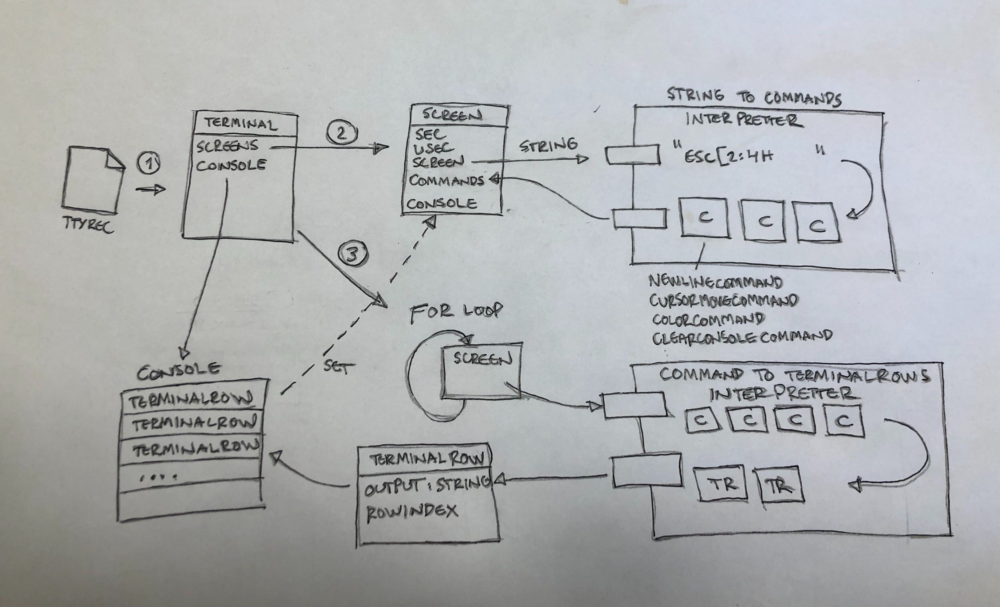
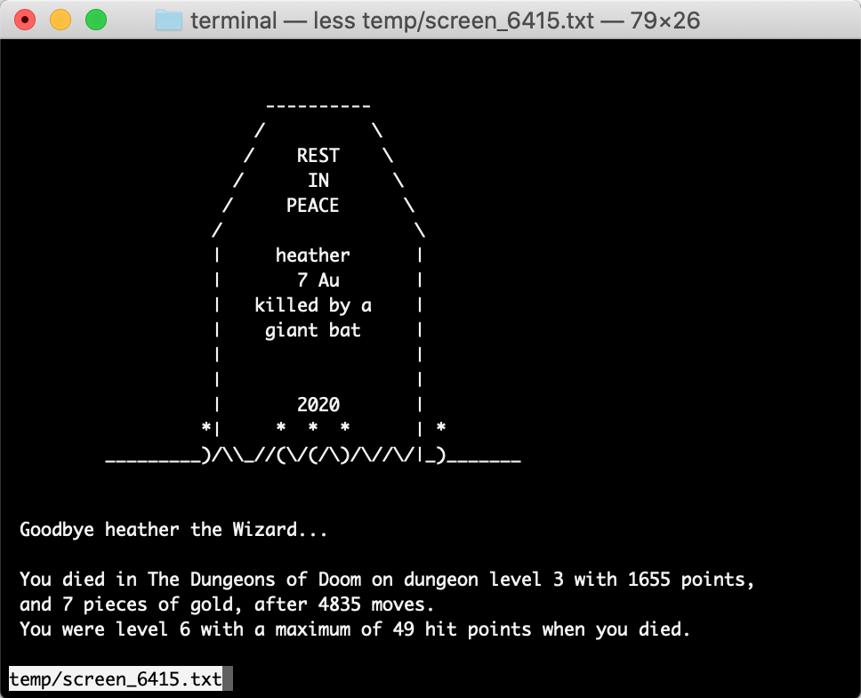

# Making a VT100 command interpreter with PHP

I came across a [ttyrec](https://en.wikipedia.org/wiki/Ttyrec) file which held inside a recorded NetHack-game. NetHack (for those who don't know) is an open source single-player roguelike video game, first released in 1987. The game is played in terminal screen and looks like this.


[Image Source: Wikipedia](https://commons.wikimedia.org/wiki/File:NethackScreenshot.gif)

Some people record their games and share their games using this ttyrec-file format. The file contains the movements of a player, move by move. I wanted to make an animated gif from that; such a gif that it ends with the image of a grave and I can build it from a command line of Raspberry Pi to a specific length of time. First, I need to parse the ttyrec-file into a editable form. Re-playing the ttyrec-file with PHP is a simple piece of code, but parsing, so I can modify that, is another issue.
```
$contents = file_get_contents("nethack.ttyrec");
$prev = null;
while(strlen($contents) > 0) {
    // get the seconds, microseconds and length of one screen to an array
    $data = unpack('Vsec/Vusec/Vlen', $contents);
    $len = (int) $data["len"];
    // get the actual printable screen and print it out
    $screen = substr($contents, 12, $len);
    print $screen;
    if ($prev !== null) {
      // wait until it's time to print the next screen
      $timeoutInMicros = (1000000 * ($data["sec"] - prev["sec"])) + ($data["usec"] - prev["usec"]));
      usleep($timeoutInMicros);
    }
    $prev = ["sec => $data["sec"], "usec" => $data["usec"]];
    $contents = substr($contents, 12 + $len); // ready for next round
}
```
I wanted to find a screen that has "Killed by" text and drop the rest of the screens with a piece of code. So time to do some coding. First I need to extract the screens from the file and interpret the commands to a printable format.

Ttyrec-file is a text file that starts with the \[seconds from 1970-01-01 00:00:00\]/\[microseconds\]/\[length of content\] and then content of a screen, followed by a same kind of block of the next screen. The content is filled with vt100-commands that are used to move cursor and print characters in a terminal. They are identified by an ESC-character and then a command which tells the terminal what to do. For example ```ESC[30m``` tells terminal to turn foreground color to white and ```ESC[2;24H``` command tells the terminal to move cursor to row 2 column 24. Everything else is outputted to terminal.

## The parser structure

First I load the ttyrec-file into a class called Terminal. Then I separate the screens from the input and then interpret the strings into commands. The commands may or may not have a printable output. Output is a string which contains ascii characters which shape the dungeon, monsters and items shown in the first image. I also added commands for backspace, newline and carriage return for easier interpretting later with a simple str_replace. Phases (1) and (2) are in the below picture.




# Interpretting the commands to present the actual terminal

In ttyrec-format, the screens follow each other, and from previous screen there might be characters left to the next screen. if I want to know what is printed in screen 401, I need to go through all the screens from 1 to 400 in case they leave any output to be printed in screen 401. All the commands have an output, which is the actual printable string. For some commands I added different variables to describe the command better. For example MoveArrowCommand has booleans up, down, left and right to determine which way to move the cursor. CursorMoveCommand has variables row and col to tell where to move the cursor before output. Interpretting commands to actual output is just looping the commands of a screen. At the end we "print out" the output with parseOutputToTerminal-function.

(The (3) path in the above picture) We get the screen, loop the commands of the screen and output strings to build the actual console state. The functions which interprets the commands looks like this.
```
foreach ($screens as $screen) {
  $commands = $screen->commands;
  foreach ($commands as $command) {
    $commClass = get_class($command);
    switch($commClass)
    {
        case ClearScreenCommand::class:
            $this->clearConsole();
            break;
        case BackspaceCommand::class:
            $this->cursorCol--;
            break;
        case NewlineCommand::class:
            $this->cursorCol = self::COLUMN_BEGINNING;
            $this->cursorRow++;
            $this->parseOutputToTerminal($command->getOutput());
            break;
        case CarriageReturnCommand::class:
            $this->cursorCol = self::COLUMN_BEGINNING;
            $this->parseOutputToTerminal($command->getOutput());
            break;
        case CursorMoveCommand::class:
            $this->cursorRow = $command->row;
            $this->cursorCol = $command->col;
            $this->parseOutputToTerminal($command->getOutput());
        ...
```

After this looping we have an array that is filled with rows that have an output. We set this ready array back to screen object so we can access the state of screen. Then we can just output them into anything, like to a text file.

```
// get screen 401
$screen = $this->screens[401];
$console = $screen->console;
$lastLine = max(array_keys($console));
$data = '';
for ($i = 0;$i <= $lastLine;$i++) {
  if (isset($console[$i])) {
    $data .= $console[$i]->output;
  }
  $data .= PHP_EOL;
}
file_put_contents("screen.txt", $data);
```
or to a gif
```
// get screen 401
$screen = $this->screens[401];
$console = $screen->console;
$lastLine = max(array_keys($console));
$im = imagecreate($this->imageWidth, $this->imageHeight);
$this->setBackgroundColor($im);
$textcolor = $this->getForegroundColor($im);
for ($i = 1;$i <= lastLine;$i++) {
    if (isset($console[$i])) {
        $x = $this->margin;
        $y = $i * $this->fontHeight + $this->margin;
        $text = $this->console[$i]->output;
        imagestring($im, $this->font, $x, $y, $text, $textcolor);
    }
}
imagegif($im, $filename);
```


Nice. After doing this for all of the screens, I have 6415 individual gif files. Now we come to the next problem. How do I combine them into a single animated gif?

[Part 2: Making an animated gif with PHP](BLOG_part2.md)

[Link to repository](https://github.com/duukkis/terminal)

[ANSI Escape sequences - VT100](http://ascii-table.com/ansi-escape-sequences-vt-100.php)

--- 


Duukkis has been building the Internet for 20 years in multiple various size projects. He is a coder and maker of things. He has done over 70 Twitter-bots, a noun- and verb- conjugator with PHP, and a portrait from 7366 pieces of Lego. He is a developer, architect and a nice guy.


