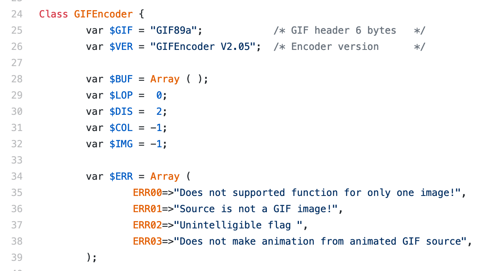
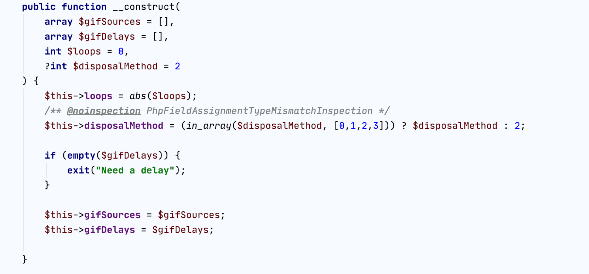
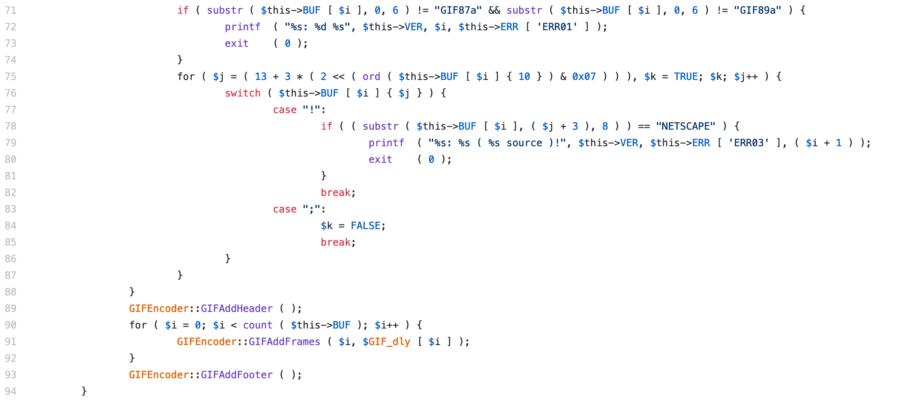
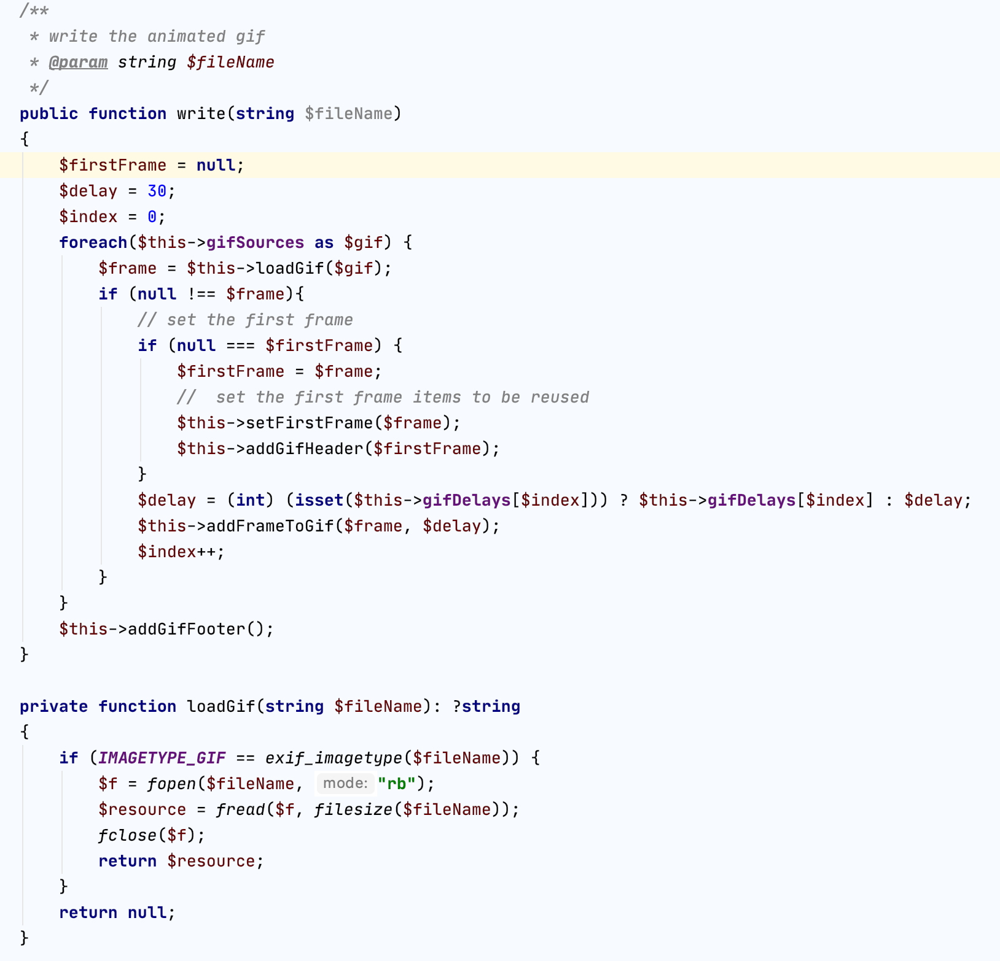
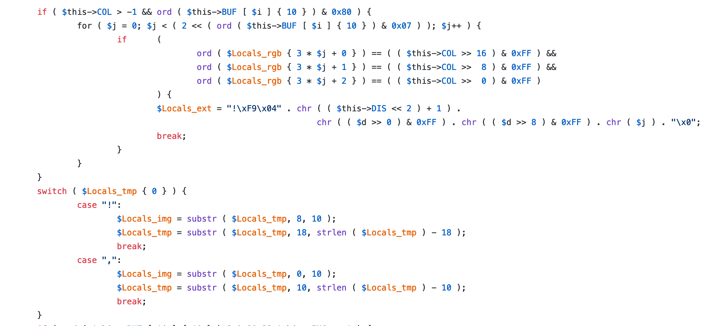
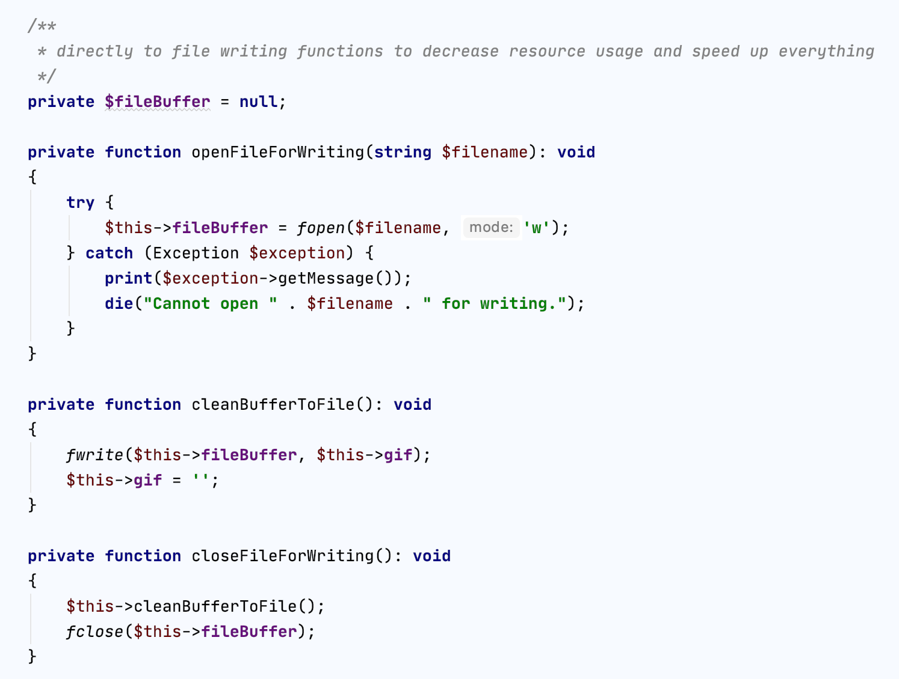

# Making an animated gif from a recorded Nethack-game - Part 1 / 2

## Part 1: Making a vt100 interpretter with PHP

I came across ttyrec file, a file that contains recorded Nethack-game. I wanted to make an animated gif out of it. Playing the ttyrec-file with PHP is a simple piece of code.
```
$contents = file_get_contents("nethack.ttyrec");
$prev = null;
while(strlen($contents) > 0) {
    $data = unpack('Vsec/Vusec/Vlen', $contents);
    $len = (int) $data["len"];
    $screen = substr($contents, 12, $len);
    print $screen;
    if ($prev !== null) {
      $timeoutInMicros = (1000000 * ($data["sec"] - prev["sec"])) + ($data["usec"] - prev["usec"]));
      usleep($timeoutInMicros);
    }
    $prev = ["sec => $data["sec"], "usec" => $data["usec"]];
    $contents = substr($contents, 12 + $len); // ready for next round
}
```
The animated gif with PHP is a bit trickier thing to do. There are some python tools that generate animated gif directly from a ttyrec-file. The issue with that was that there was no commands to stop the video at a certain frame or a command to speed up the video for rate 2 or to manipulate the screens. And those are the things I want easily to do. So time to do some coding.

The ttyrec-file contains vt100-commands that are used to move cursor and print characters in a terminal. They are identified with ESC-character and then a command to tell the terminal what to do. For example ```ESC[30m``` tells terminal to turn foreground color to white or ```ESC[2;24H``` to move cursor to row 2 column 24. Everything else is output to terminal.


First I load the text file into Terminal. Then I separate the text into screens and then I interpret the string into commands. The commands may or may not have an output to print. Output is a string which contains ascii string for output. I also added commands for backspace, newline and carriage return for easier interpretting later with a simple str_replace.

# Interpretting the commands to present the actual terminal
The screens follow each other, so from previous screen there might be characters left to the next screen. if I want to know what is printed in screen 401, I need to go through all the screens from 1 to 400 in case they leave any output to be printed in screen 401. All the commands have an output, which is the actual printable string. Some commands have different variables like MoveArrowCommand has booleans up, down, left and right and CursorMoveCommand has a row and col to tell where to move the cursor before output. Interpretting is just looping the commands of a screen. At the end we "print out" the output with parseOutputToTerminal-function.
```
foreach ($commands as $command) {
    $commClass = get_class($command);
    switch($commClass)
    {
        case ClearScreenCommand::class:
            $this->clearConsole();
            break;
        case BackspaceCommand::class:
            $this->cursorCol--;
            break;
        case NewlineCommand::class:
            $this->cursorCol = self::COLUMN_BEGINNING;
            $this->cursorRow++;
            $this->parseOutputToTerminal($command->getOutput());
            break;
        case CarriageReturnCommand::class:
            $this->cursorCol = self::COLUMN_BEGINNING;
            $this->parseOutputToTerminal($command->getOutput());
            break;
        case CursorMoveCommand::class:
            $this->cursorRow = $command->row;
            $this->cursorCol = $command->col;
            $this->parseOutputToTerminal($command->getOutput());
        ...
```

The end result of this looping is a array that is filled with terminal rows. Then we can just output them into anything.

Like a text file
```
$lastLine = max(array_keys($this->console));
$data = '';
for ($i = 0;$i <= $lastLine;$i++) {
  if (isset($this->console[$i])) {
    $data .= $this->console[$i]->output;
  }
  $data .= PHP_EOL;
}
file_put_contents("screen.txt", $data);
```
or to a gif
```
$lastLine = max(array_keys($this->console));
$im = imagecreate($this->imageWidth, $this->imageHeight);
$this->setBackgroundColor($im);
$textcolor = $this->getForegroundColor($im);
for ($i = 1;$i <= lastLine;$i++) {
    if (isset($this->console[$i])) {
        $x = $this->margin;
        $y = $i * $this->fontHeight + $this->margin;
        $text = $this->console[$i]->output;
        imagestring($im, $this->font, $x, $y, $text, $textcolor);
    }
}
imagegif($im, $filename);
```
Nice. After doing this, I have 6415 individual gif files. How do I combine them into a single animated gif?

[Link to repository](https://github.com/duukkis/terminal)

> Duukkis is the god of Internet. He has been building the Internet for 20 years in multiple various size projects. He solves customer's problems with his infinite wisdom and confidence.


[link to part 2]

# Making an animated gif from a recorded Nethack-game - Part 2 / 2

## Part 2: Making an animated gif with PHP
I came across ttyrec file, a file that contains recorded Nethack-game. I wanted to make an animated gif out of it. [link]In part one we have interpretted a ttyrec-file into a 6415 different gifs.[/link]

I have a transformed a ttyrec-file into a 6415 different gifs. Now a question arise: How to make an animated gif out of those gifs? Here again there is ready tools starting from ffmpeg, a command tool that is capable of doing any kind of media files and transformations. Then again, I want to define the delays directly in code so that I can get the delays exactly the same as in original ttyrec-file and possibly modify the delays. I sterted with some googling. What are the options? Has someone already made this? 

My limitations were that I wanted the tool to be done with PHP as the vt100-terminal interpretter was already done with that and I could package them to together. All I could find was a code done 12 years ago, copied across the internet which looked horrible. Did not find other options. After some debugging, I realized that the code builds the gif from existing gifs to a new gif with bitwise operations and concatenating individual gifs into a single gif. 

> I realized that this programmer had made something brilliant and amazing but at the same time something undocumented and horrible.

Tried out the code and it worked. So started my refactoring. First before anything made a test to verify the functionality. Just a script that can be run and verify that the code still works. Before a commit or a bigger change, run it, so you can be sure that the code still works and you haven't broken anything.

Started with the class variables
___



Looks ok. We have an array and some ints - no descriptive names. Skip this for now. 

___

Then we check the constructor. The horrification starts.


We have a constructor with some checks. First we need to have ```$GIF_src``` and ```$GIF_dly``` as arrays otherwise we have an error "Does not supported function for only one image!" and ```$this->COL``` is some sort of color, also there is ```$GIF_mod``` that tells if the GIF_src is a list of filenames or a list of opened gifs as strings.

> Let's fix this



* choose descriptive variable names
* PHP 7.4 has strict typing of variables, lets give types to variables
* Also I realized at some point that $GIF_LOP is an integer that tells how many times animated gif loops and $GIF_DIS is disposal method of background color between frames and that can have four values defined in specs of gif.
    - Disposal Methods:
    - 000: Not specified - 0
    - 001: Do not dispose - 1
    - 010: Restore to BG color - 2
    - 011: Restore to previous - 3
* So valid values are 0, 1, 2, 3.

* Notice that we don't need to test anymore are the variables arrays or not because PHP will throw an error if they are not that type

___

Then continue with the constructor. 



The $this->BUF has the gifs in a array of strings. Also code checks that the files are gifs and also a check that GIF89a gifs are not animated gifs. And then in the constructor we add the gif header, add individual gifs and the the gif footer.

> Lets fix this



* Make a separate function for constructing the actual gif. The idea is that class contructor sets the variables and then we have a public function that actually does something
* We loop the gifs, open them one by one. On the first round we add header, then we add the frames and finally we add the footer.
* Removed static method calls ```GIFEncoder::GIFAddHeader```. Even the old code uses $this variables, so nothing static about this
* When looking at loadGif function, I actually made the functionality worse. I don't check if the gif is animated or not. I rely on the user not to send animated gifs to this class. Not going to check everything but rely on the programmer.

___

Then lets check those GIFAddHeader and GIFAddFooter functions.


What. Is. Happening. Here. Wikipedia to the resque and perticulary [Wikipedia's gif](https://en.wikipedia.org/wiki/GIF) article. And the string "!\377\13NETSCAPE2.0\3\1" is a good clue. Took a few rounds to get this to the final state.


1. The magical strings to constants - they don't change
2. The &0x80 bitwise operation to a function. To isGCTPresent and getGCTlength functions.
3. $cmap is actually length of color table, name it correctly
4. Haven't actually tested what happens if function ```isGCTPresent``` returns false, we have no gif header, so most likely something fatal.
5. Added comments. There is no way that this can be commented too much since not a lot of people know how to encode a gif properly.

---

Then to a masterpiece of a function called GIFAddFrames. Adding a single gif to animated gif.


Here we initialize some variables. ```$this->BUF``` has the gifs, so we do something with the first gif, presented here as ```$this->BUF[0]``` and the current frame ```$this->BUF[$i]```. Also there is something magical in string index 10. 

> Let's Fix this.

* First we remove the firstFrame. We create a function that is called in the initial loop, to set some variables from the first frame and after that they are reusable for frame 1, 2, 3, 4, ... n.


Then the rest of the beginning, we just rename variables and extract functions.


Then in that function there is more



* If the initialization of color is not set (> -1) - just set the color at the beginning and no need for that
* Then a comparison and a switch case, where we compare the the first character of ```$Locals_tmp```. The "," is the beginning of image descriptor block, don't know why the other one is there - just remove that and we get this


and the substrings at the end are image data and image descriptor.


Few more lines to go.

The $this->IMG > -1 is to check if this is the first frame and then three a bit similar blocks of code. What the rest actually is an if else condition. If the global color table of a gif exists and the number of colors or just the table differ from each other we need to add that, otherwise that is the same as the global and we can skip that.


---

Then when I tried to run this with 6415 gifs I got out of memory error. Bummer.
 
That was because the code builds a single string before outputting anything. Needed to add some helpers for writing the gif.



This helped on two things. The execution time went from 63 seconds and running out of memory to 4 seconds and writing succesfully a 28 MB animated gif.


[Link to repository](https://github.com/duukkis/terminal)

> Duukkis is the god of Internet. He has been building the Internet for 20 years in multiple various size projects. He solves customer's problems with his infinite wisdom and confidence.

---

> Finally I would like to give my thanks to [Wikipedia](https://en.wikipedia.org/wiki/GIF) to a page that had the actual bytes of a gif. So in short the gif consists of header, information about the gif width and height, information about colors, background color index, pixel aspect ratio and finally there is color table, graphic control extension where we have for example transparent color index and then finally the image data and finally closing byte ```;```.
___


