# Making an animated gif from a recorded Nethack-game - Part 2 / 2

## Part 2: Making an animated gif with PHP
I came across ttyrec file, a file that contains recorded Nethack-game. NetHack is an open source single-player roguelike video game, first released in 1987. I wanted to make an animated gif out of it.

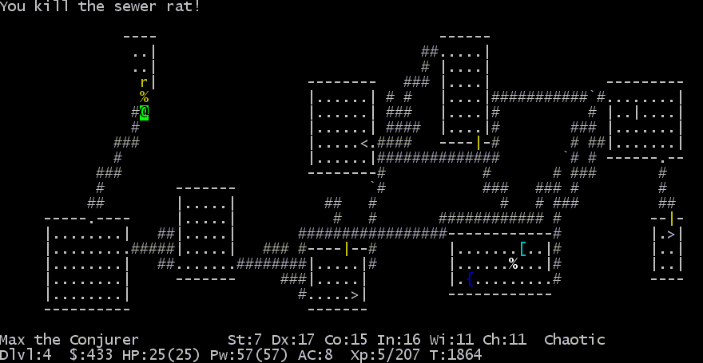
[Image Source: Wikipedia](https://commons.wikimedia.org/wiki/File:NethackScreenshot.gif)

[In part one we have interpretted a ttyrec-file into a 6415 different gifs.](BLOG.md)

I have a transformed a ttyrec-file into a 6415 different gifs. How to make an animated gif out of those gifs? Here again there is ready tools starting from ffmpeg, a command tool that is capable of doing any kind of media files and transformations. Then again, I want to define the delays directly in code so that I can get the delays exactly the same as in original ttyrec-file and possibly modify the delays. I started with some googling. What are the options? Has someone already made this? 

My limitations were that I wanted the tool to be done with PHP as the vt100-terminal interpretter was already done with that and I could package them to together. All I could find was a piece of code that was done 12 years ago. The code was also copied across the internet but the code looked pretty bad. It had no comments, the variables were non descriptive and there were very clear errors in it. After a while decided that I had no other options. Copied the code and started thinking what was happening there. After some debugging, I realized that the code builds the animated gif from existing gifs to a new gif with bitwise operations and at the end concatenating individual gifs into a single gif.

> I realized that this programmer had made something brilliant and amazing but at the same time something undocumented and very difficult to understand.

Tried out the code and it worked. So started my refactoring. First before anything I made a test to verify the functionality. Just a script that creates an animated gif from a list of gifs. I could verify after each modification that the code still works. After a bigger change, run it, so you can be sure that the code still works and you haven't broken anything.

Then to refactoring. Started with the class variables
___

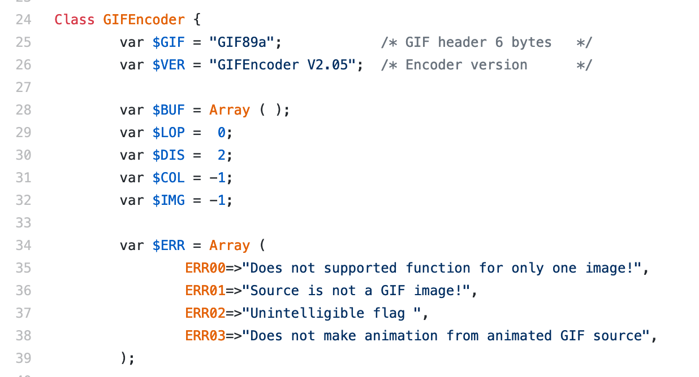

Looks ok. We have an array and some ints - no descriptive names. Skip this for now. 

___

Then onward to the constructor.

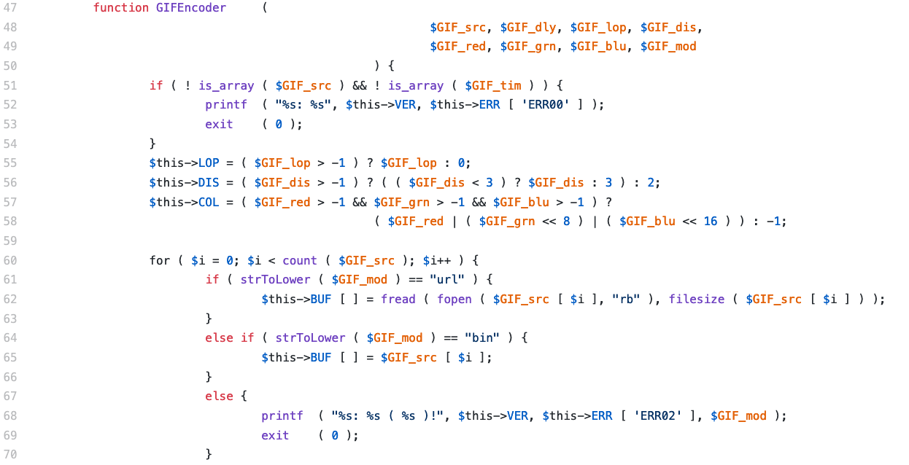

We have a constructor with some checks. First we need to have ```$GIF_src``` and ```$GIF_dly``` as arrays otherwise we have an error "Does not supported function for only one image!". ```$this->COL``` is some sort of color, also there is ```$GIF_mod``` that tells if the GIF_src is a list of filenames or a list of opened gifs as strings.

> Let's fix this

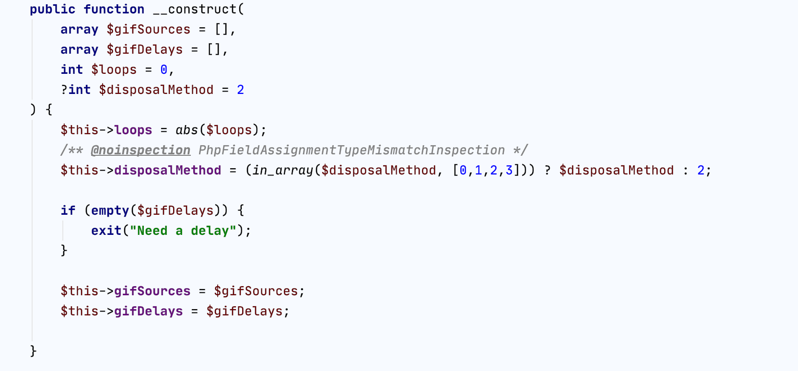

* Choose descriptive variable names
* In PHP 7.4 has strict typing of variables, lets give types to variables
* Also I realized at some point that $GIF_LOP is an integer that tells how many times animated gif loops. Rename that.
* $GIF_DIS is disposal method of background color between frames and that can have four values defined in specs of gif.
    - Disposal Methods:
    - 000: Not specified - 0
    - 001: Do not dispose - 1
    - 010: Restore to BG color - 2
    - 011: Restore to previous - 3
* So valid values are 0, 1, 2, 3. Rename and validate the value.
* Notice that we don't need to test anymore are the variables arrays or not because PHP will throw an error if they are not that type as they are typed.

___

Then continue with the constructor. 

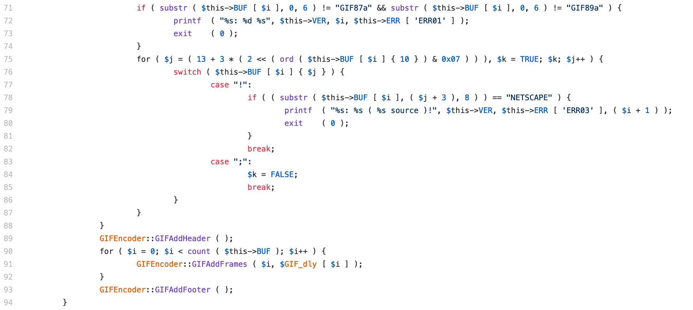

The ```$this->BUF``` has the gifs in a string array. Also code checks that the files are gifs and also that GIF89a gifs are not animated gifs. After checks in the constructor we add the gif header, add individual gifs and lastly the gif footer is added.

> Lets fix this

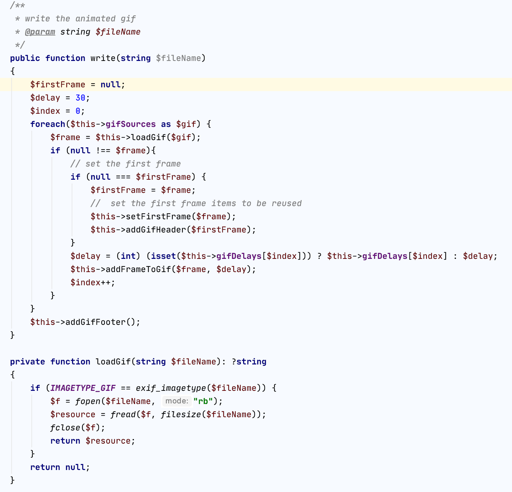

* Make a separate function for constructing the actual gif. The idea is that class contructor sets the variables and then we have a public function that actually does something
* We loop the gifs, open them one by one. On the first round we add header and firstFrame that we need later. Then we add the frames and finally we add the footer.
* Removed static method calls ```GIFEncoder::GIFAddHeader```. Even the old code uses $this variables, so nothing static about this
* When looking at loadGif function, I actually made the functionality worse. I don't check if the gif is animated or not. I rely on the user not to send animated gifs to this class. So I'm going to rely on the programmer. The check can be done somewhere else if needed.

___

Then lets check those helper-functions GIFAddHeader and GIFAddFooter.

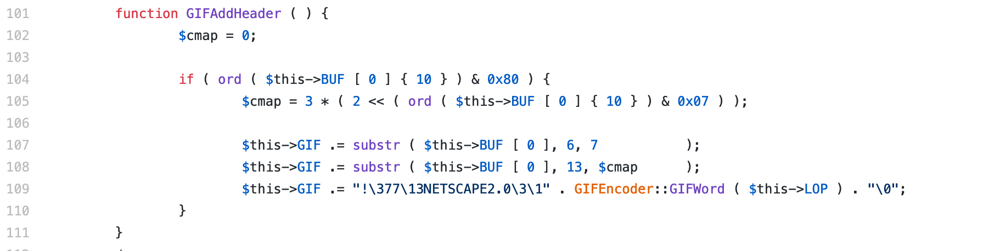
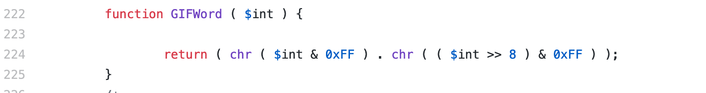


What. Is. Happening. Here. Wikipedia to the resque and perticulary [Wikipedia's gif](https://en.wikipedia.org/wiki/GIF) article. And the string "!\377\13NETSCAPE2.0\3\1" is a good clue. Took a few rounds of iteration to get this to the final state.

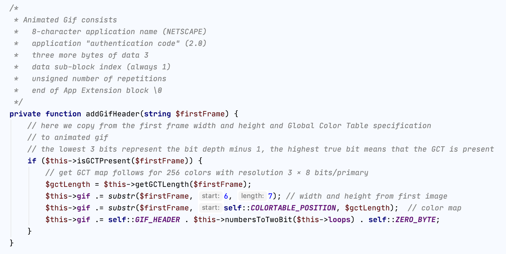

1. Put the magical strings to constants - they don't change
2. Send the bitwise operations (<< & 0x07) to a named functions. So now we have isGCTPresent and getGCTlength functions.
3. $cmap is actually length of color table, so name it correctly
4. Haven't actually tested what happens if function ```isGCTPresent``` returns false, we have no gif header, so most likely something fatal. Tough luck.
5. Added comments. There is no way that this can be commented too much since there is not a lot of people who know how to encode a gif properly.

---

Then to a masterpiece of a function called GIFAddFrames. Adding a single gif to animated gif.

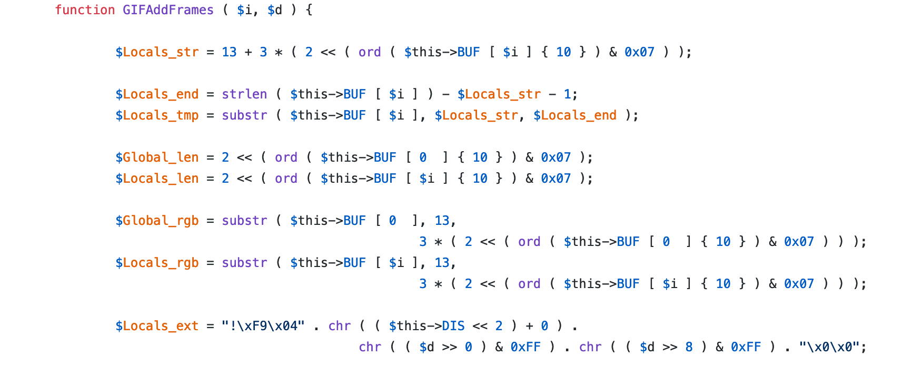

Scary looking stuff. Here we initialize some variables. ```$this->BUF``` has the gifs, so we do something with the first gif, presented here as ```$this->BUF[0]``` and the current frame ```$this->BUF[$i]```. Also there is something magical in string index 10. 

> Let's Fix this.

* First we remove the firstFrame. Create a function that is called in the initial loop where we set some variables from the first frame and after that they are reusable for frame 1, 2, 3, 4, ... n. So no need to extract these values in every loop.

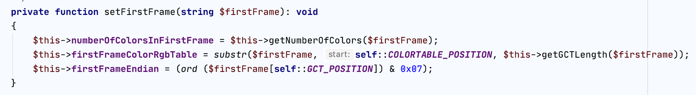

Then the rest of the beginning of function, we just rename variables and extract functions. Not the prettiest, but will do.
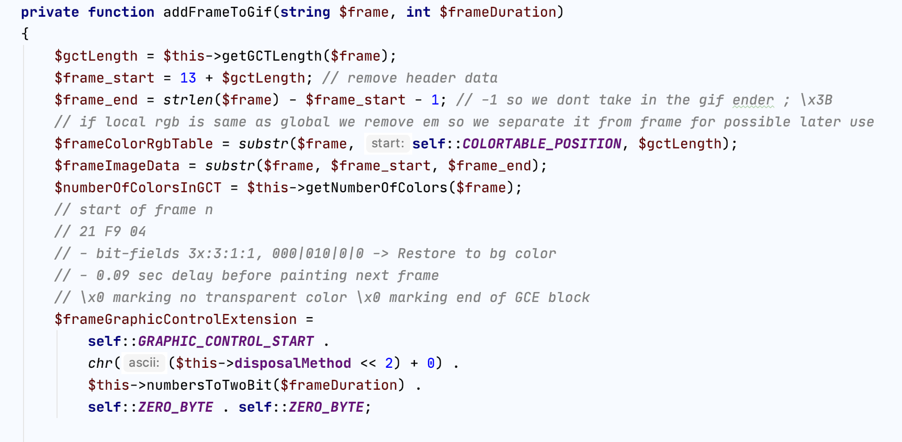

Then continue with the function. There is more.

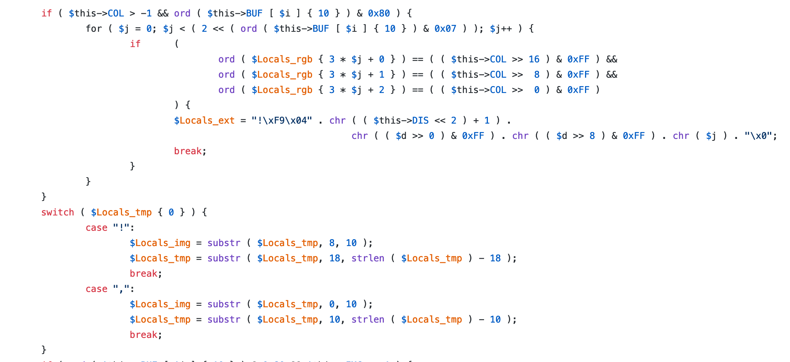

* If the initialization of color is not set ```($this->COL > -1)``` we have a check - we just set the color at the constructor and we have no need for that
* Then a some sort of comparison and a switch case, where we compare the the first character of ```$Locals_tmp```. The "," is the beginning of image descriptor block, don't know why the other one is there - just remove that and we get this

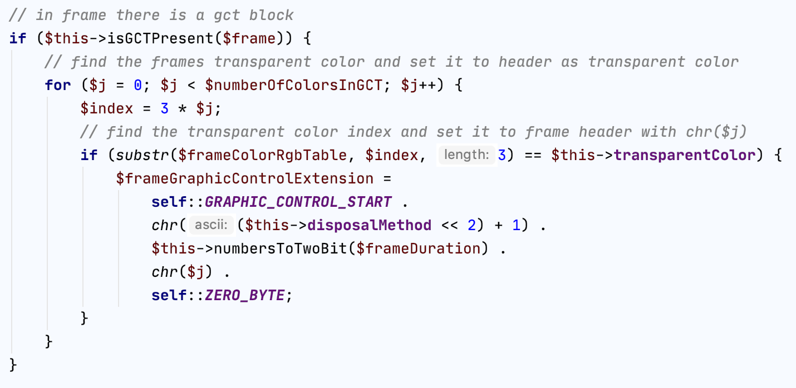

and the substrings at the end are image data and image descriptor.

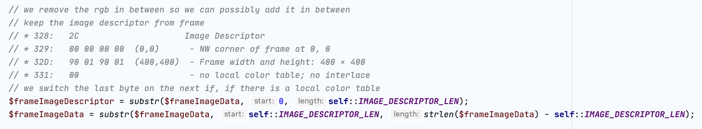

Few more lines to go.
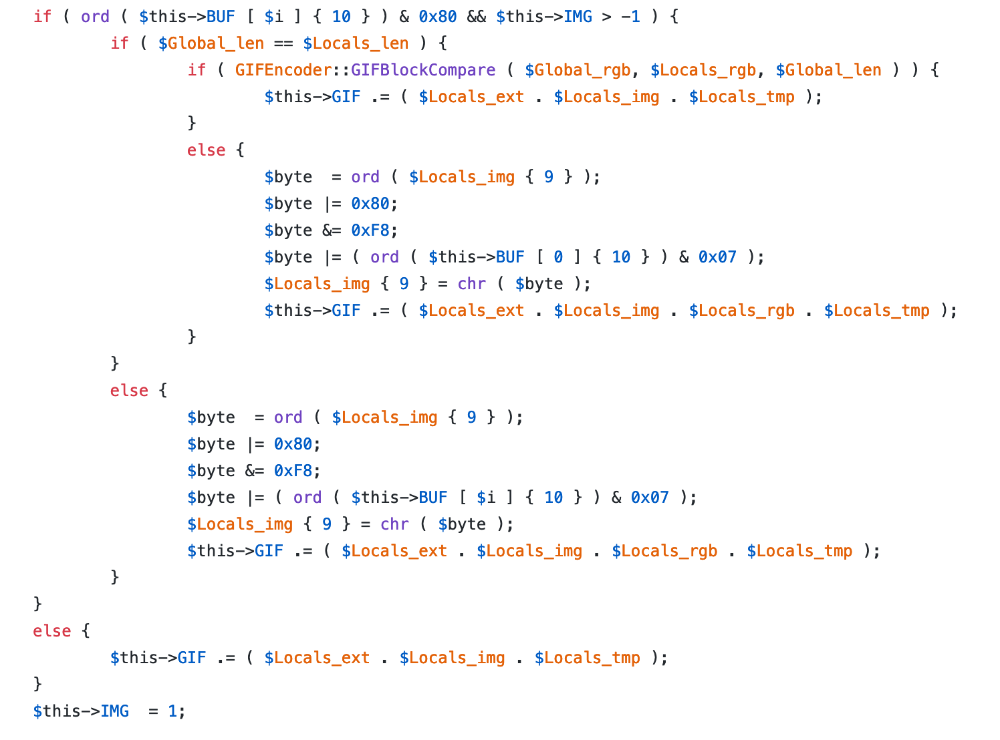
The ```$this->IMG > -1``` is to check if this is the first frame and then three a bit similar blocks of code. The same can be achieved with a single if else condition. If the global color table of a gif exists and the number of colors or the color table differ from each other we need to add that, otherwise that is the same as the global and we ignore the local color table. 

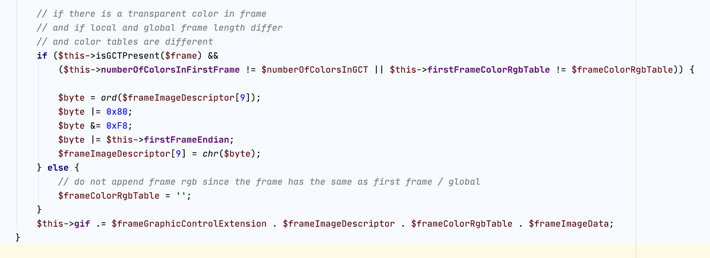

And that's it. Refactored.

---

Then when I tried to run this with 6415 gifs I got out of memory error. Bummer.
 
That was because the code builds a single string before outputting anything. Needed to add some helpers for writing the gif.

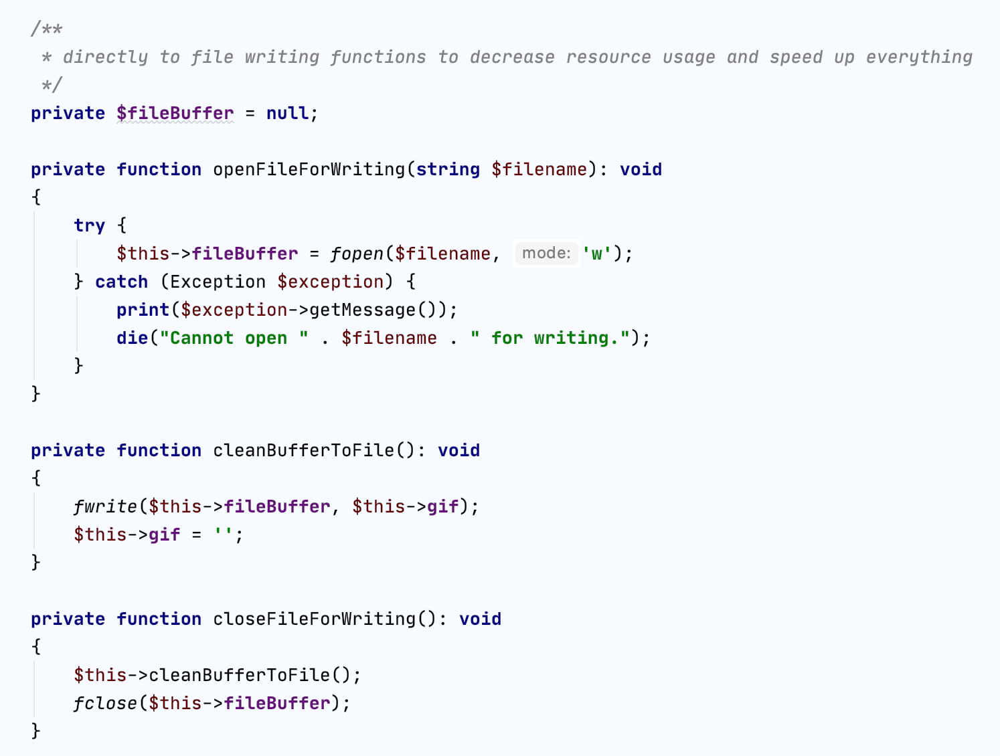

Call the ```openFileForWriting``` at the beginning of gif creation, ```cleanBufferToFile``` in the for loop where we add the gifs and ```closeFileForWriting``` at the end. Cool. This helped on two things. The execution time went from 63 seconds and running out of memory to 4 seconds and writing succesfully a 28 MB animated gif.

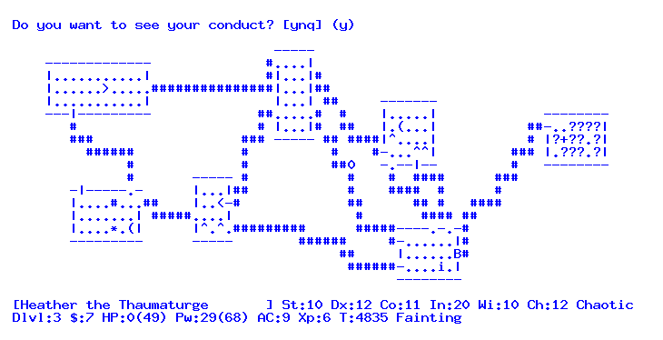

The two parts of this project were different and both very interesting in their own way. The interpretting of vt100-commands had clean new structure but some of the commands like backspace character brought intriguing aspects on building this. On both the parts I had to research lots of background knowledge from the specifications. The animated gif building part was pretty complex refactoring project. It took at least 10 iterations before I got the code into a shape that I wanted. On the vt100-terminal part I broke the code once, but the debugging, what is wrong now, took longer time than on refactoring part. The refactoring is nice as you have a working code, so you always know if it's working or not and if it's not, you can revert the part you have just changed. When building something new you have problems that haven't been solved yet. Both skills are very important for a developer.

[Link to repository](https://github.com/duukkis/terminal)

> Duukkis is the god of Internet. He has been building the Internet for 20 years in multiple various size projects. He solves customer's problems with his infinite wisdom and confidence.

---

> Finally I would like to give my thanks to [Wikipedia](https://en.wikipedia.org/wiki/GIF) to a page that had the actual bytes of a gif. So in short the gif consists of header, information about the gif width and height, information about colors, background color index, pixel aspect ratio and finally there is color table, graphic control extension where we have for example transparent color index and then finally the image data and finally closing byte ```;```.
___
